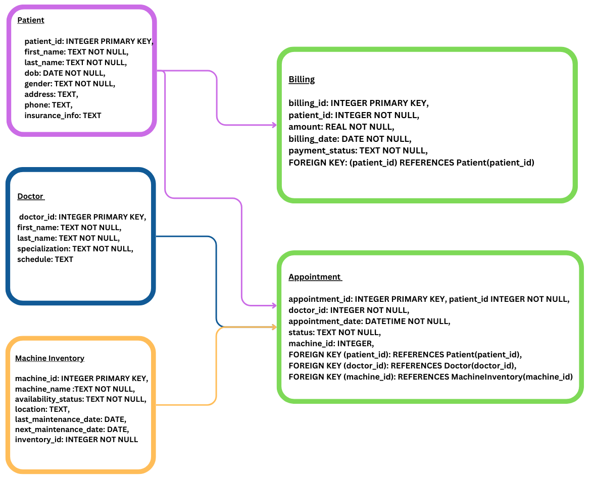

# hospital_management_database
This hospital management database efficiently organizes patient records, doctor details, appointments, billing, inventory, and medical equipment. It integrates doctors' aviability, tracks machine availability, and maintains billing status. The database supports automated scheduling and inventory monitoring, enhancing hospital operations. Dummy data was generated using Faker to simulate real-world scenarios. 

